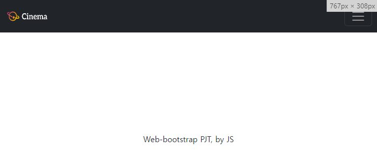
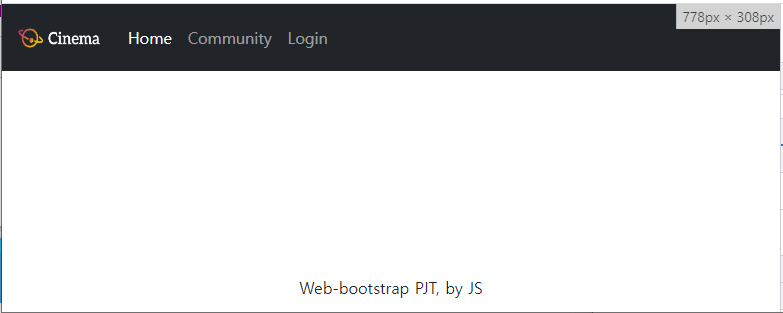
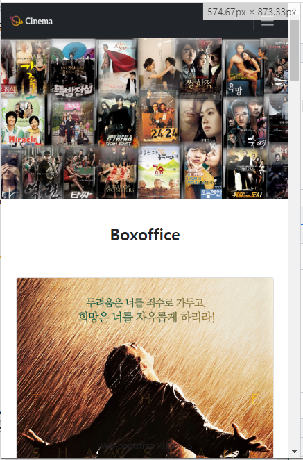
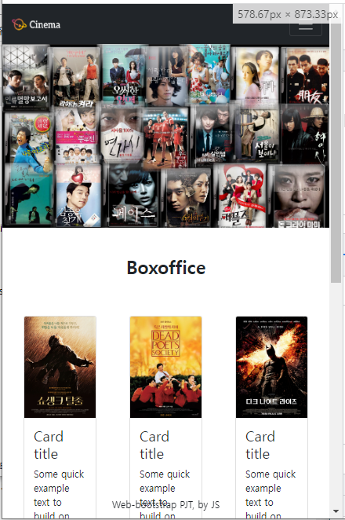
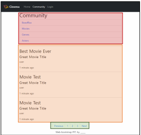
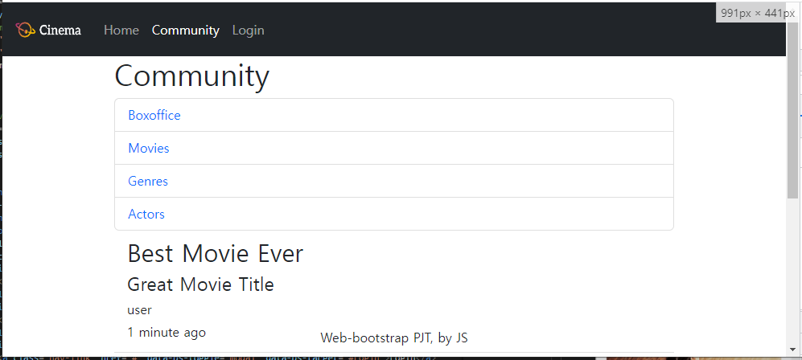
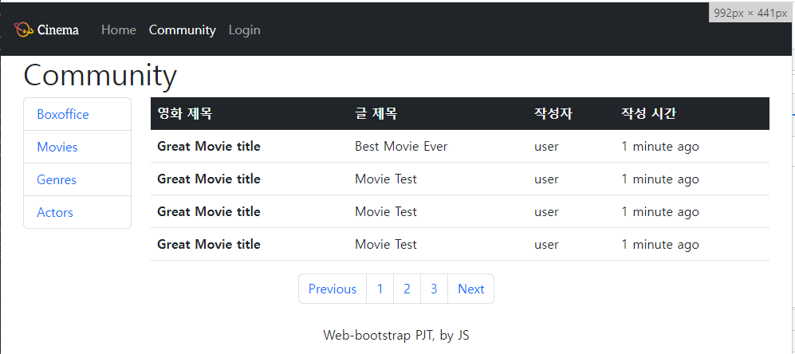

# 03_pjt

## 01_nav_footer.html

### 문제

Navigation Bar

1. Bootstrap Navbar Component를 참고합니다.
2. 스크롤을 하더라도 항상 화면 상단에 고정되어 있습니다.
3. 로고 이미지는 제공된 logo.png를 사용합니다.
4. 로고 이미지는 하이퍼링크 역할도 가능하며 클릭 시 02_home.html로 이동해야 합니다.
5. 내비게이션 메뉴 중 Home, Community는 하이퍼링크 역할도 가능하며 클릭 시 각각
   02_home.html, 03_community.html로 이동해야 합니다.
6. 내비게이션 메뉴 중 Login은 클릭 시 Bootstrap Modal Component가 나타납니다.
   • Modal Component 내부에는 HTML form 요소를 배치합니다.
7. Viewport의 가로 크기 별 반응형 디자인은 스크린 샷 예시를 참고하여 일치하도록 합니다.
8. Footer는 항상 화면 하단에 수직,수평 가운데 정렬되어 고정되어 있습니다.

### 풀이

구현 방법

1) bootstrap의  navigation bar를 이용합니다. 

2) 상단 고정을 위해 sticky-top 클래스를 줍니다. (오류에서 추가설명)

3) navbar-white가 기본적으로 설정되어있어 글씨가 까만색으로 나오므로 navbar-dark로 바꿔주어 글씨를 하얀색으로 바꿔줍니다.

4) navbar-expand-md 를 사용하여 765px미만일때는 메뉴가 가로 정렬되고 이상일 때는 메뉴가 세로 정렬되도록 설정하였습니다.

5) login 클릭 시 출력되는 modal 창은 bootstrap에서 유사한 창으로 들고왔습니다.

6) navigation bar에서 만든 login 클래스로 data-bs-toggle="modal"과 modal창을 출력하는 구문에서 지정한 id를 data-bs-target="#{id}"를 입력합니다.

### 출력화면

## 02_home.html

### 문제

Header

1. Bootstrap Carousel Component로 구성합니다.
2. 이미지는 최소 3장 이상 사용하며 자동으로 전환됩니다.

Section

1. Section 내부의 개별 요소(article)들은 Bootstrap Card Component로 구성합니다.
   • 이미지, 제목, 설명을 포함합니다.
   • 이미지는 제공된 영화 포스터 이미지를 사용합니다.
2. 개별 요소들은 좌우 일정한 간격을 가집니다. (간격은 자유롭게 설정 가능)
3. Viewport의 가로 크기가 576px 미만일 경우 한 행에 1개씩 표시됩니다.
4. Viewport의 가로 크기가 576px 이상일 경우 한 행에 2개 이상 표시됩니다. 
   (자유롭게 설정 가능)
5. Viewport의 가로 크기 별 반응형 디자인은 스크린 샷 예시를 참고하여 일치하도록
   합니다.

### 풀이

1. 01번의 코드를 긁어옵니다.

2. 클래스에 carousel slide를 넣어주고 밑에 슬라이드에 쓸 이미지들을 넣어줍니다. 이때 image의 바로 부모에 carousal-item 클래스를 지정해주고 넣는 이미지의 부모중 한곳에만 active 클래스를 넣어줍니다. 

3. 영화 section의 경우 grid를 이용해 만들었습니다. 

4. 각 column에 card 클래스를 사용하여 이미지와 설명을 적어넣었습니다. 깔끔하게 보이기 위해서 m-3로 margin을 설정했습니다.

5. 각 card가 담긴 column 클래스를 가진 article 태그 구문에 width가 576px 미만일경우 한개만, 이상일 경우 3개보이도록 col-12 col-sm-4 클래스를 추가해줍니다.

### 출력화면

## 03_community.html

## 문제

Aside (게시판 목록)

1. HTML aside 요소로 이루어져 있습니다.
2. Bootstrap List group Component로 구성합니다.
3. 내부의 각 항목은 클릭이 가능한 하이퍼링크이지만, URL은 별도로 없습니다.
4. Viewport의 가로 크기가 992px 미만일 경우
   HTML main 요소 영역 전체만큼의 너비를 가집니다.
5. Viewport의 가로 크기가 992px 이상일 경우
   HTML main 요소 영역 기준으로 좌측 1/6 만큼의 너비를 가집니다.
6. Viewport의 가로 크기 별 반응형 디자인은 스크린 샷 예시를 참고하여
   일치하도록 합니다.

Section (게시판)

1. 게시판은 HTML section 요소로 이루어져 있습니다.
2. 게시판은 Viewport의 가로 크기에 따라 전혀 다른 요소를 표시합니다.
   • Viewport의 가로 크기가 992px 미만일 경우
   게시판은 HTML article 요소의 집합으로 표시되며,
   HTML main 요소 영역 전체만큼의 너비를 가집니다.
   • Viewport의 가로 크기가 992px 이상일 경우
   게시판은 Bootstrap Tables Content로 구성되며, 
   HTML main 요소 영역 기준으로 우측 5/6 만큼의 너비를 가집니다.

Pagination

1. Bootstrap Pagination Component로 구성합니다.
2. 게시판 하단에 위치하며 너비는 자유롭게 설정합니다.
3. 자신의 영역 안에서 수평 중앙 정렬되어 있습니다.
4. 내부의 각 항목은 클릭이 가능한 하이퍼링크이지만, URL은 별도로 없습니다.

## 풀이

1. 02번과 비슷한 방법으로 grid를 이용해서 만들었습니다.

2. width 가 992px 미만일때 나타나는 article과 width 가 992px이상일 때 나타나는 페이지 둘다 일단 만들었습니다.

3. 보이는 해당 페이지의

   주황색부분의 경우 list의 flush를 사용하여 만들었습니다.

4. 표는 table 클래스를 사용하여 많들었습니다. 

5. 그리고 table은 d-none 클래스를 줘서 원래 안보였다가 d-lg-block 클래스에 의해서 992px 이상일 때 보이도록 하였습니다.

6. 리스트는 d-lg-none 클래스를 줘서 992px 미만에서만 보이도록 만들었습니다.

### 출력화면

## 에러 및 해결법

1. 01번 문제를 풀 때 navigation bar의 포지션을 fixed-top으로 줬는데 03번에서 페이지 제목이 bar뒤로 들어가는 문제가 발생했습니다. 그래서 띄어쓰를 주려고 했지만 뭔가 멋있지 않아서 포지션에 대해서 찾아봤고 sticky라는 포지션을 이용하여 문제를 해결할 수 있었습니다.
   sticky는 원래는 static으로 되어있다가 페이지가 임계점에 이르면(스크롤을 내리면) fixed로 바뀌는 position이었습니다. 

2. 01번 문제를 풀 때 배경색을 검정으로 주고 text-white 로 컬러를 바꿨는데 글자가 계속 검정색이라서 헤맸습니다. 그래서 bootstrap 사이트를 찾다가 navbar 설명에서 배경색을 바꿀때 같이 navbar-dark로 주는 것을 보고 따라서 해봤습니다. 제가 잘 못찾아서 일단 해당 navbar가 배경이 dark일 때 제일 보기 좋은 형으로 보인다라고 이해했습니다.

3. modal을 이용했을 때 02번에서 문제가 생겼습니다. 원래는 modal창은 밝아야하는 modal창도 어두웠습니다. 그래서 다시 bootstrap 사이트를 읽어보니깐 modal의 경우 영향을 받지 않도록 body의 최상단 우선순위(맨 밑줄)에 놓으라고 되어있었습니다.

## 느낀점 및 후기

1.  일주일도 안되는 시간안에 이렇게 많은 걸 익힐 수 있다는 사실에 놀랐습니다. 월요일만 하더라고 이번주 정말 힘들겠다고 생각했는데 목요일쯤 차츰 나아지고 오늘 그래도 프로젝트를 다 끝마쳐서 다행입니다. 

2. 사실 세세한 부분은 손볼게 많은데 일단 급하게 진행한 것 같습니다. 집가서 왜인지 찾아보고 고쳐봐야 속이 시원할 것 같습니다.

3. 빨리 끝내신 분들이 몇 분 계셨는데 그분들만큼 빨리 과제를 하고 싶습니다. 항상 좋은 목표가 되어주십니다.

4. 프로젝트 작성방법도 주변에 보니깐 정말 다양하고 개성있게 작성하셔서 다음에는 이모지도 넣고 이미지도 능숙하게 넣어서 더 블링블링하게 꾸며봐야겠습니다. 물론 프로젝트를 빨리 끝내야 가능할 것 같습니다.
